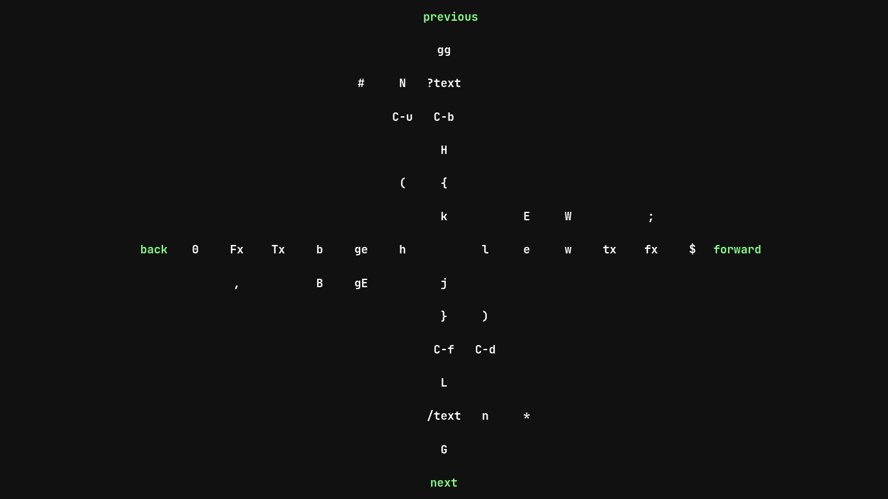
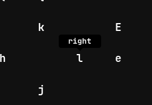

# vim cheatsheet
***This is not intended to be responsive***

vim-motion is a vim motion cheatsheet with tooltips.

## Screenshots



## Installation
```sh
git clone https://github.com/dreadsd/vim-motion.git
cd vim-motion
```
Open the index.html file with [one of the following browsers](https://github.com/dreadsd/vim-motion/blob/main/README.md#support).

## Usage
Holding the cursor over any command will show its description as a tooltip.

## Support
This is a general grid browser support, check yours.

|Browser|Version|
|-------|-------|
|Chrome | > 57  |
|Firefox| > 52  |
|Edge   | > 16  |
|Safari | > 10.1|
|Opera  | > 44  |

## Credits
<https://wikileaks.org/ciav7p1/cms/page_3375350.html>

## License
[MIT](https://opensource.org/licenses/MIT)
